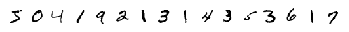

# imshowtools


This library lets you view images in Jupyter notebooks in a much simpler and intuitive way. Ships with a better 'imshow' function with Multi Images, Smart Wrap and BGR support!.

## Installation

To install `imshowtools`, simply do

```py
pip install imshowtools
```

## Usage

Import `imshow` from `imshowtools` and use it like:
 
```py
from imshowtools import imshow
imshow(lenna)
```


## Advanced Usage

#### Colorspaces

OpenCV lover? `imshowtools` can also handle `cv2`'s BGR images

```py
import cv2
cv2image = cv2.imread('lenna.png')
imshow(cv2image)
```


```py
cvshow(cv2image)                        # cvshow convenience function
imshow(cv2image, mode='BGR')            # imshow with mode
```


**Tip**: `imshow` can display `[h, w, 1]` shaped images as well 
in addition to `[h, w]` single channel images. 

#### Show Multiple Images
```py
imshow(image_1, image_2, image_3)
```

#### Show Multiple Images from List

```py
imshow(*[my_image_list])
```

Example:

```py
mnist = tf.keras.datasets.mnist

(x_train, y_train), (x_test, y_test) = mnist.load_data()
x_train, x_test = x_train / 255.0, x_test / 255.0
[x_train.shape, y_train.shape], [x_test.shape, y_test.shape]
imshow(*x_train[:25])
```


Multiple images with colorspace:

```py
imshow(*x_train[:100], cmap='gray')
```


#### Get Plot as Image

You can set `return_image` attribute to `True` (to get 'RGB') 
or to `['RGB', 'RGBA', 'ARGB', 'BW', 'L', "BGR", "BGRA", "ABGR"]` in any imshow function
to get the image as numpy hwc or hw array with appropriate colorspace. Note that the image
will not be displayed when using `return_image`.

It is very useful if you want to save the multi-image plots. 

```py
image = imshow(*x_train[:100], cmap='gray', return_image=True)
print(image.shape)
# Output (288, 432, 4)
```


#### Single Row and Single Column

```py
imshow(*x_train[:16], cmap='binary', rows=1)
```


```py
imshow(*x_train[:4], cmap='binary', columns=1)
```


#### Smart Wrapping / Custom Rows and Columns

`imhow` chooses the optimal layout:

* Have 6 images? You get 2x3
* Have 12 images? You get 3x4
* Have 20 images? You get 4x5

You can also choose to manually control how many rows and columns you
```py
imshow(*my_image_array, rows=3, columns=4)
```

#### Namespaces
If you do not want to use `imshow` directly in your app (maybe you have another function named imshow), you shall use it like

```py
import imshowtools
imshowtools.imshow(your_image)
```

or if you like to use a custom namespace
```py
import imshowtools as my_namespace
my_namespace.imshow(your_image)
```

## Uninstall

To uninstall `imshowtools`,

```py
pip uninstall imshowtools
```

## Contributing

Pull requests are very welcome.

1. Fork the repo
1. Create new branch with feature name as branch name
1. Check if things work with a jupyter notebook
1. Raise a pull request

## Licence

Please see attached [Licence](LICENCE)